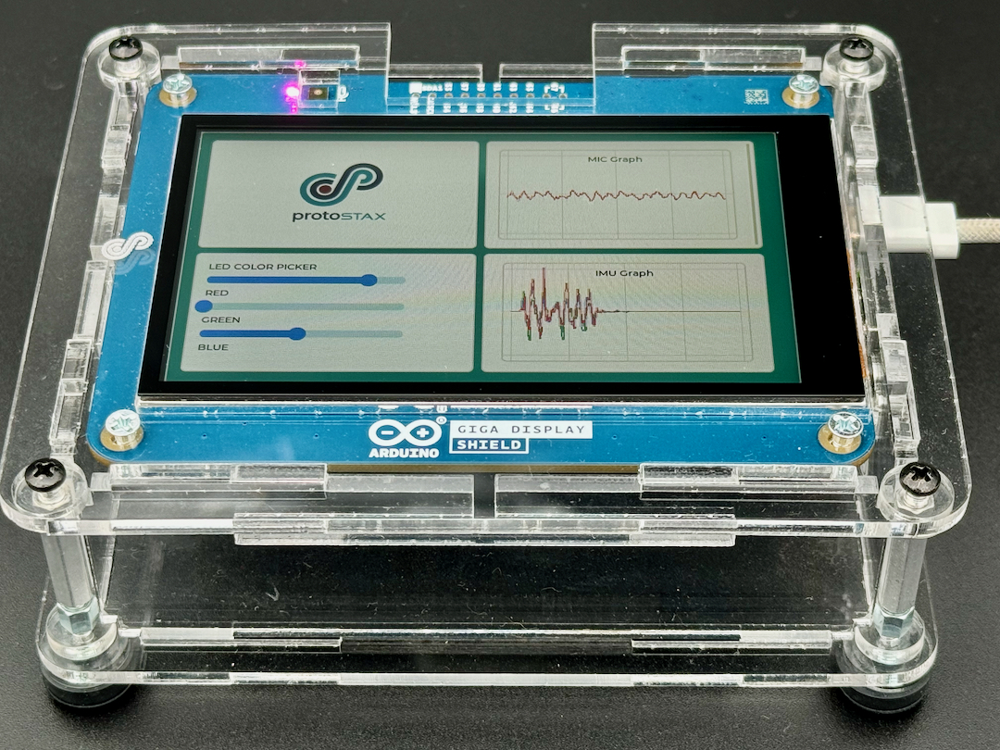

# ProtoStaxAG_Arduino_Giga_Display_Demo
Demo sketch for the Arduino Giga Display Shield

Built with:
* [ProtoStaxAG Enclosure for Arduino Giga Display](https://www.protostax.com/products/protostax-ag-enclosure-for-arduino-giga-display)
* Arduino Giga Display Shield
* Arduino Giga R1 WIFI



## Prerequisites

None

## Installing

The demos use the following libraries:

* LVGL
* PDM 
* Arduino_BMI270_BMM150
* Arduino_GigaDisplay

You can use the Arduino Library Manager to install the necessary libraries if not already installed
Arduino IDE->Sketch->Include LIbrary->Manage Libraries 

Get the source code
```
git clone https://github.com/protostax/ProtoStaxAG_Arduino_Giga_Display_Demo.git
```

## Usage

The demo showcases the RGB LED, Microphone and IMU on the Arduino Giga Display Shield utilizing its touch screen and the LVGL library.

The display shield and board are housed in the ProtoStaxAG Enclosure for Arduino Giga Display. 

This demo helps you get started with the Arduino Giga Display Shield and also showcases how you can package your project in an attractive and functional enclosure to make look more professional and usable. The enclosure also allows for enough room to add an extra shield or two, so you can add your own custom circuitry as well to further expand on the project. 

## License

Written by Sridhar Rajagopal for ProtoStax. BSD license, all text above must be included in any redistribution

A lot of time and effort has gone into providing this and other code. Please support ProtoStax by purchasing products from us!
